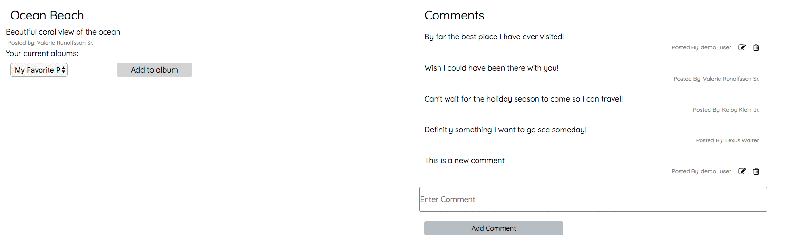

# [liqr](https://liqr.herokuapp.com/)

[liqr](https://liqr.herokuapp.com/) is a web application similar to Flickr that allows users to upload their own photos, create albums, and explore photos by other users. Users also have the ability to add / edit comments on each photo.


## Technologies Used

+ PostgreSQL
+ Ruby on Rails
+ React / Redux
+ jQuery
+ Cloudinary
+ Masonry

## Features

+ Secure frontend to backend user authentication using BCrypt
+ Users can create albums and organize photos into albums
+ Users can comment on photos and see which albums the photo belongs to
+ Users can upload photos directly to a cloud image server
+ Photos will dynamically calculate the images when displaying to create a seamless and modern grid
+ Users can use drag and drop to upload photos

#### Explore

Users can view all photos available and comment across other user's pictures
The photos will be calculated automatically to ensure that both sides of the container will be filled. The number of columns will adjust according to the webpage width and re-render for the best complete fit.


The Masonry only handles the image distribution, all CSS styles are handled in the stylesheets folder. This dynamic render is process by using the Masonry package like so:
```js
<Masonry
className={'my-gallery-class'}
options={masonryOptions}
>
{
  photos.map( (photo, idx) =>
  <PhotoIndexItem  key={idx} photo={photo} />
)}
</Masonry>
```

#### Uploading Photos

Users can upload a photo to Cloudinary and add title and description to their photo. Users also have the ability to edit / delete the photo. The drag and drop ability is done through this:
```js
<Dropzone
  multiple={false}
  accept="image/*"
  onDrop={this.onImageDrop}
  className="drop-box"
  >
  <p className="drop-text">Drop an image or click to select a file to upload.</p>
</Dropzone>
```


#### Adding to albums

Users can create / delete albums and add photos to albums.


#### Adding comments to photos

Users can add, update, delete comments on photos.



#### Additional Resources

+ [Proposal Wireframes](https://github.com/henrychen11/liqr/wiki/wireframes)
+ [Database Schema](https://github.com/henrychen11/liqr/wiki/schema)

####Possible future features

+ Photo tags
+ User profile pages
+ Search
